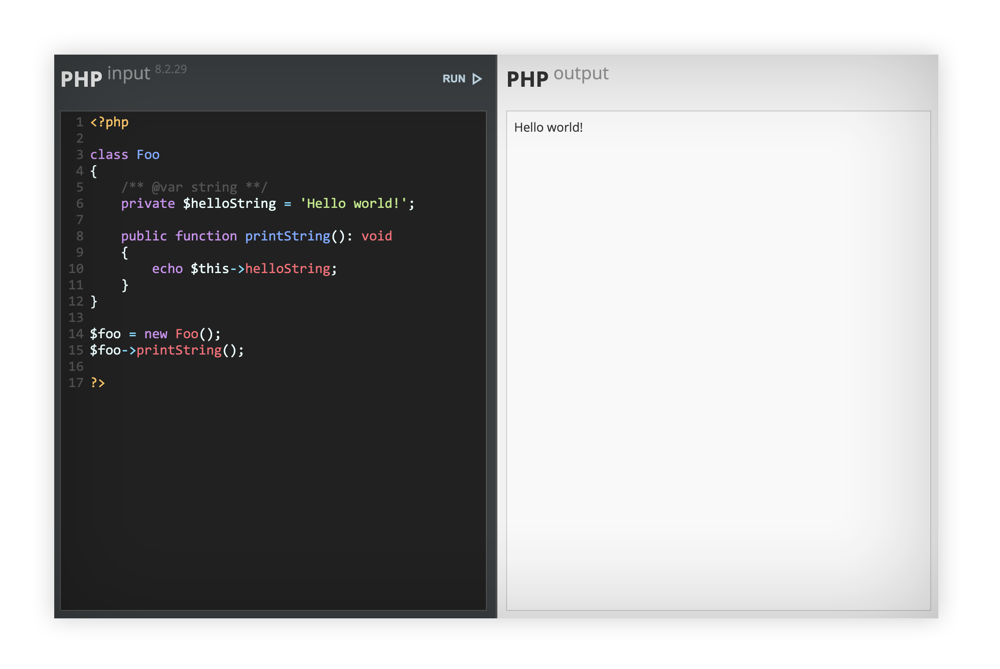

# Simple PHP Test Editor

Lightweight PHP-based code testing editor. It allows users to write, execute, and debug PHP code snippets directly in the browser. This project is designed for developers who want a quick and simple way to test PHP code without setting up a full development environment.

## Features

- **CodeMirror Integration**: Provides a modern code editor with syntax highlighting for PHP.
- **Live Execution**: Run PHP code snippets and view the output instantly.
- **Customizable Themes**: Uses `@fontsource/open-sans` and `material-symbols` for a clean and professional UI.
- **Lightweight and Fast**: Minimal dependencies for quick setup and usage.

## Installation

1. Clone the repository:
   ```bash
   git clone https://github.com/varienos/simple-php-test-editor.git
   ```

2. Navigate to the project directory:
   ```bash
   cd simple-php-test-editor
   ```

3. Install dependencies:
   ```bash
   npm install
   ```

4. Ensure you have a PHP server running. You can use the built-in PHP server:
   ```bash
   php -S localhost:8000
   ```

5. Open your browser and navigate to:
   ```
   http://localhost:8000
   ```

## Usage

- Write your PHP code in the editor.
- Click the `RUN` button to execute the code.
- View the output in the results pane.



## Dependencies

- [@fontsource/open-sans](https://www.npmjs.com/package/@fontsource/open-sans)
- [CodeMirror](https://codemirror.net/)
- [Material Symbols](https://github.com/google/material-design-icons)

## Contributing

Contributions are welcome! If you have ideas for improvements or new features, feel free to open an issue or submit a pull request.

## License

This project is licensed under the ISC License. See the `LICENSE` file for details.


---

Happy coding! 🚀
